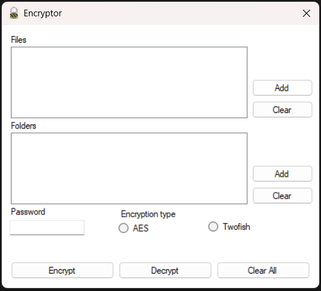

# Encryptor - Windows Application



## Overview

Encryptor is a Windows Forms-based application developed in C#/.Net that provides secure encryption and decryption functionalities. It allows users to encrypt and decrypt files and folders using AES and Twofish cryptographic algorithms. Additionally, it includes functionality to unzip compressed files before encryption or after decryption.

## Features

- **Encrypt Files & Folders**: Securely encrypt files and entire folders using AES and Twofish algorithms.
- **Decrypt Files & Folders**: Easily decrypt previously encrypted files and folders.
- **Multiple Encryption Algorithms**: Choose between AES (Advanced Encryption Standard) and Twofish.
- **File Compression Support**: Automatically unzip files before encryption and after decryption.
- **User-Friendly Interface**: Simple and intuitive Windows Forms UI for easy operation.

## Cryptographic Algorithms Used

- **AES (Advanced Encryption Standard)**: A widely used symmetric encryption algorithm providing strong security.
- **Twofish**: A fast and secure symmetric encryption algorithm, considered an alternative to AES.

## Prerequisites

Before running the application, ensure you have the following installed:

- Microsoft Visual Studio (with C#/.Net support and Windows Forms enabled)
- Crypto++ Library (for AES and Twofish implementations)
- zlib or any unzip library (for file decompression support)
Unzip the file 
## Installation

1. Clone the repository:
   ```sh
   git clone https://github.com/your-repo/encryptor.git
   ```
2. Open the project in Visual Studio.
3. Install necessary dependencies (Crypto++, zlib, etc.).
4. Build and run the application.

## Usage

1. Launch the Encryptor application.
2. Select a file or folder for encryption or decryption.
3. Choose an encryption algorithm (AES or Twofish).
4. Click on the "Encrypt" or "Decrypt" button.
5. If dealing with compressed files, the application will handle unzipping automatically.
6. Save the output file or folder at the desired location.

## License

This project is licensed under the MIT License - see the LICENSE file for details.

## Acknowledgments

- [Crypto++](https://www.cryptopp.com/) for cryptographic functions.
- [zlib](https://zlib.net/) for file compression support.
- Microsoft Windows Forms for GUI framework.

MIT License

Copyright (c) 2025 Hitesh H
